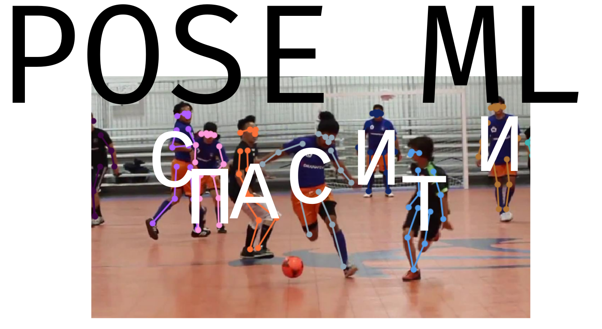

Recognizing poses and typing text.

## How to launch?

You need docker and git.

```bash
git clone https://github.com/cab404/sirius-poseml --recurse-submodules
cd sirius-poseml
docker build -t poseml ./
docker run -p 80:8080 poseml
```

... and open [localhost](http://localhost) in browser

## Whyyyyy

Cause that's fun! Try for yourself!

Also it can be easily retrained to be a kinect-like thingmajig.

## Contributors

@dodolfin
@IvanBespalov64
@qodize
@TheLostDesu
@heyley
@cab404

